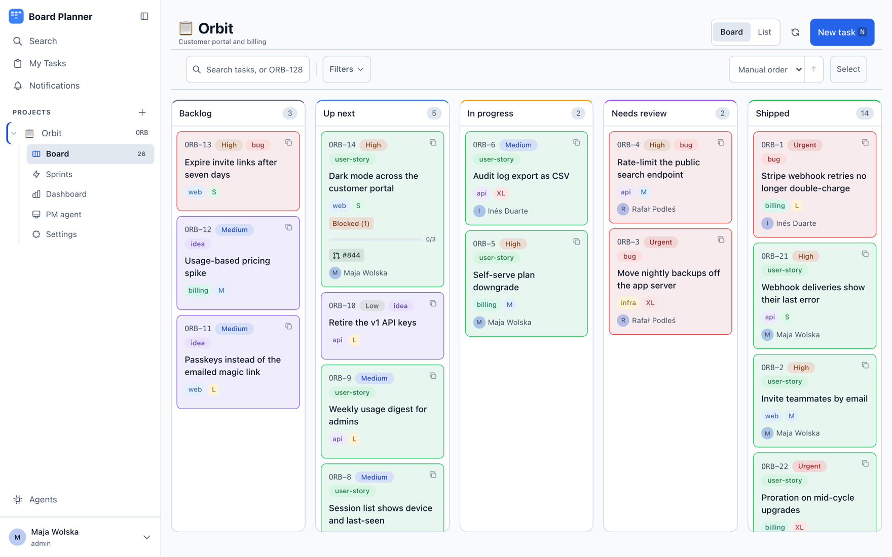
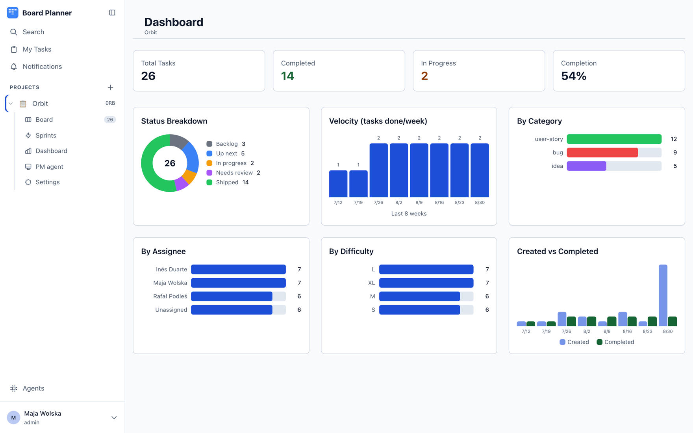

<div align="center">


# Board Planner

**One board. Your team works it. So do your agents.**

A Kanban board, sprints and a dashboard small teams can actually run — plus an MCP server and a
REST API, so coding agents pick up the same tasks under the same rules as everybody else.

[Website](https://board-planner.com) · [Documentation](https://board-planner.com/docs) · [Quick start](https://board-planner.com/docs/getting-started/quick-start/)


<br><br>



</div>

---

Most trackers bolt automation on: a bot posts a comment, a script moves a card, and the real state
of the work lives somewhere the board cannot see. Board Planner starts from the other end. The
board, the REST API and the MCP server are three doors into one model, with the same permission
checks behind each. An agent moving a task to *In Review* passes the same status rules as a person
dragging the card, and leaves the same trail in the same history.

Self-hosted, single instance, no tenants. `docker compose up` and it is yours.

## One task, all the way through

| Step | What happens |
| --- | --- |
| **1. It starts as a question** | The PM agent reads the board, notices what is missing and brings you the decision — not a pile of tickets you never asked for. |
| **2. You approve it** | Assign the task to an agent and drag it into the column you approve from. That pair *is* the hand-over. Until then it is a proposal and no worker touches it. |
| **3. The agent takes it** | A worker you run yourself claims it, works in its own git worktree, and reports each phase back onto the board — branch, edits, tests, model quota left. |
| **4. It stops** | Every gate you configured runs, then it opens a pull request and hands the task back. Nothing merges, because you said a person reads the diff. |
| **5. You finish it** | Accept, and it is merged, moved, and written into the task's own history: who did what, and when. |

## What you get

### It's a board first

Columns you name, in an order you choose. Each one is mapped to a role automation understands
(`backlog`, `approved`, `active`, `review`, `blocked`, `done`), so renaming *Up next* to *Ready*
breaks nothing. Drag-and-drop board, list view, sprints, dependencies and subtasks, recurring tasks, and
⌘K search across every task from anywhere in the app.

It follows your system theme, and the whole app is built for both:


### A task holds everything the work needs

Acceptance criteria that tick off one by one, dependencies, the pull request that closes it, custom
fields you define per project, every comment and every change since it was created. Nothing lives in
a side channel. Name a branch `bp-8/dark-mode` and the pull request finds its task on its own.


### Your agents work the same board

Twelve MCP tools over HTTP put the board in your terminal, so Claude Code reads the backlog, claims
a task and moves it — through the same permissions a teammate gets. API tokens can be scoped to
specific projects, and the scope is enforced centrally, so it holds for REST and MCP alike.

### You hand it over, it hands it back

An **execution worker** is a coding agent you run on a machine you choose. The board only ever tells
it which task and which repository — never where anything lives. It works in an isolated git
worktree, so the checkout you are sitting in is never touched, and it stops at the column where you
said a person has to look.

### And nothing merges without your rules

A **gate** is a check that has to pass before anything merges: diff size, paths you declared off
limits, tests present and green, a build, and a second model reading the diff. You choose which run.
The first one that says no hands the task back to a person, with the reason attached, instead of
merging anyway.

> [!NOTE]
> Any column with the `review` role is a stop sign for automation. Work waits there for a person —
> and while a run holds a task, moving it out of its column is refused with a 409 through every
> writer: the board, the edit form, MCP and the PM agent.

### Enough to answer the Monday question

How you are doing, what is piling up, and whether you are finishing as fast as you are starting.
Six charts, no spreadsheet.



### The rest

Notifications in-app, by email, or to Slack and Discord — per user, per project, per event. Project
audit trail. Webhooks, signed. GitHub and GitLab PR linking. Works on a phone.

## Quick start

You need Docker. Nothing else — no Node, no MongoDB.

```bash
docker compose up -d --build
```

Open <http://localhost:3000>. The first account created on the sign-in page becomes the instance
administrator; every account after that is made from **Settings → Users**.

> [!WARNING]
> **Create that first account before anyone else can reach the address.** An instance with no users
> offers "First time? Create Account" to whoever asks, and there is no invitation and no setup
> token. Two requests inside that window can both be answered before either account is written, and
> both are then administrators. On a deployment that goes live the moment it builds, the window
> opens before you have opened the page.

Stop it with `docker compose down`. The database lives in the `mongo-data` volume and survives that;
`docker compose down -v` deletes it.

### Without Docker

Needs **Node 26** and a **MongoDB 4.4+** you provision yourself.

```bash
npm install
MONGODB_URI=mongodb://localhost:27017/boardplanner npm run build
MONGODB_URI=mongodb://localhost:27017/boardplanner npm start
```

`npm run dev` for the development server. Copy `.env.example` to `.env.local` for a place to keep
the variables below.

## Connect an agent

The MCP server is built into the app at `POST /api/mcp` — nothing to clone, nothing to build. Create
a token under **Settings → API Tokens**, scope it to the projects the agent should touch, and point
the client at one URL:

```json
{
  "mcpServers": {
    "boardplanner": {
      "type": "http",
      "url": "https://your-instance.example.com/api/mcp",
      "headers": { "Authorization": "Bearer cp_..." }
    }
  }
}
```

Twelve tools: `list_projects`, `get_project`, `list_tasks`, `get_task`, `create_task`,
`update_task`, `change_task_status`, `list_sprints`, `create_sprint`, `update_sprint`, `add_comment`,
`list_comments`.

Clients that want a connector instead of a pasted token get full **OAuth 2.1 with PKCE** and dynamic
client registration at the same URL — no client secret. For stdio-only clients, a standalone server
ships in [`mcp-server/`](mcp-server); it builds on its own and is not part of the Docker image:

```bash
cd mcp-server && npm install && npm run build
```

## Configuration

Everything is optional except the database. Put overrides in a `.env` file next to
`docker-compose.yml`.

| Variable | Default | What it does |
| --- | --- | --- |
| `MONGODB_URI` | `mongodb://mongo:27017/boardplanner` | Point the app at your own MongoDB instead of the bundled one |
| `APP_PORT` | `3000` | Host port the app is published on |
| `APP_ORIGIN` | `http://localhost:${APP_PORT}` | Comma-separated origins the app is served from, used to reject cross-site writes |
| `PUBLIC_ORIGIN` | compose default; otherwise `APP_ORIGIN` when it names exactly one origin | The one address this instance calls its own. Required for MCP and PM OAuth |
| `NEXT_PUBLIC_APP_URL` | `http://localhost:${APP_PORT}` | Public URL used in notification and webhook links. **Build-time** |
| `COOKIE_ALLOW_INSECURE` | `1` (compose only) | Issue the session cookie without `Secure` and without the `__Host-` prefix, for an instance served over plain HTTP |
| `TRUSTED_PROXY_HOPS` | `0` | How many proxies append to `X-Forwarded-For` in front of this app |
| `ENCRYPTION_KEY` | — | 32 bytes (hex or base64) encrypting stored integration tokens at rest |
| `ENCRYPTION_KEYS_OLD` | — | Comma-separated retired keys, so a rotation can still read what they wrote |
| `WEBHOOK_SIGNING_SECRET` | — | Signs outgoing webhook deliveries |
| `OPENAI_API_KEY` | — | AI task generation in the task form |
| `OPENROUTER_API_KEY`, `PM_MODEL`, `PM_MAX_TOKENS`, `PM_DAILY_TURN_CAP`, `PM_DAILY_TOKEN_CAP`, `PM_SCHEDULER_TICK_MS` | — | PM agent |
| `SMTP_HOST`, `SMTP_PORT`, `SMTP_USER`, `SMTP_PASS`, `SMTP_FROM` | — | Email notifications |
| `DIGEST_HOUR`, `DIGEST_TIMEZONE`, `DIGEST_TICK_MS` | `7`, `Europe/Warsaw`, `300000` | When the opt-in daily digest goes out |

A few of these have sharp edges worth reading once.

<details>
<summary><strong><code>COOKIE_ALLOW_INSECURE</code> and <code>APP_ORIGIN</code></strong> — remove the first once you have TLS</summary>

Both are **runtime** values, read on every request. The compose file turns `COOKIE_ALLOW_INSECURE`
on because it publishes the app on `http://localhost`, where a browser silently discards a `Secure`
cookie and every request after login fails with a 401. **Remove it once the instance is behind
TLS** — the app's own default is the secure, `__Host-`-prefixed cookie, and nothing but this
variable turns that off.

`APP_ORIGIN` is **required whenever `COOKIE_ALLOW_INSECURE=1`**, and the app refuses to start
otherwise. Writes are rejected unless the browser proves the request came from the app's own origin,
and over plain HTTP at anything other than `localhost` the browser sends no `Sec-Fetch-Site` header,
so the only remaining proof is `Origin` matching this list. Set it to the URL users actually open —
`https://board.example.com`, or `http://192.168.1.10:3000` for a LAN self-host — with no trailing
path.

</details>

<details>
<summary><strong><code>TRUSTED_PROXY_HOPS</code></strong> — too low is the worse mistake</summary>

This decides whether `X-Forwarded-For` means anything here. It is the only thing the failed-login
throttle can key on, and the header is a header: with nothing in front of the app, a caller who
varies it gets a fresh counter every request and the throttle never bites. So the default is `0` —
the header is not read at all, and anonymous callers share one bucket at a raised threshold.

**Behind a reverse proxy, set it to the number of proxies that append to that header** (`1` for a
single nginx or Caddy in front, `2` if there is a CDN in front of that).

Getting the number wrong has consequences in both directions. Set it **too high** and the header is
refused as not matching what you described — every caller then shares the anonymous bucket, which is
bounded but shared. Set it **too low** and the address counted is one your proxy chain writes rather
than the client's, so every request on earth may land in the same bucket — and because that bucket
looks to the app like a genuine address, it is metered at the *tight* per-address ceilings rather
than the raised anonymous ones. Too low throttles the whole world as though it were one caller.

</details>

<details>
<summary><strong><code>ENCRYPTION_KEY</code></strong> — how to generate one, and how to rotate it</summary>

It encrypts the GitHub, GitLab, Coda and MCP credentials the app stores. Generate one with
`openssl rand -hex 32`. Without it those fields simply cannot be saved — the app answers the save
with an error rather than writing the token in cleartext, and says so at startup. A key that is set
but is not 32 bytes **stops the app from starting**: a fumbled variable is not the same as an absent
one and must not be treated as one.

To rotate: put the new key in `ENCRYPTION_KEY` and move the old one to `ENCRYPTION_KEYS_OLD`
(comma-separated, so several generations can coexist). Each stored value names the key that wrote
it, so old and new secrets are readable side by side; anything re-saved is written with the new key.
Drop a retired key from the list only once nothing still refers to it — the app names the missing key
id when it meets one it cannot read.

</details>

<details>
<summary><strong><code>NEXT_PUBLIC_APP_URL</code> and <code>PUBLIC_ORIGIN</code></strong> — why there are two</summary>

`NEXT_PUBLIC_APP_URL` is a **build-time** value: Next.js inlines `NEXT_PUBLIC_*` into the bundle, so
it is passed as a build argument and baked into the image. Changing it means rebuilding —
`docker compose up -d --build`. There is no runtime override.

`PUBLIC_ORIGIN` exists because the other two cannot answer "what is this instance's own address".
`APP_ORIGIN` is a list, and nothing says which entry is the public one. `NEXT_PUBLIC_APP_URL` is
baked into the image, so in the running container it is whatever the *build machine* had — which is
why it is not consulted at all: as a fallback it was always set and always wrong, and it silently
replaced the intended failure with a discovery document naming `localhost`.

So **an instance reachable at anything other than the compose default must set `PUBLIC_ORIGIN`.**
The MCP endpoint, both `/.well-known` documents and the PM agent's OAuth `redirect_uri` are built
from it and answer **500** when it resolves to nothing — deliberately, because the value they used
to fall back to was a request header. It must be an `http`/`https` URL; `board.example.com:8443` is
not one, however much it looks like it.

</details>

> [!IMPORTANT]
> MongoDB is pinned to **4.4** and is not published on a host port — only the app container reaches
> it. The aggregations deliberately avoid operators that only exist from 5.0, and pinning the
> version is what keeps that true.

## How it is built

Next.js 16 (App Router) and TypeScript, Tailwind CSS 4, MongoDB with Mongoose. Auth is a session
cookie in the browser and a Bearer token for API clients and OAuth; the browser never holds a
password.

```
src/
  app/api/          REST API — ~90 routes, plus the MCP endpoint at /api/mcp
  app/              board, task detail, sprints, dashboard, search, settings
  components/       kanban/, tasks/, search/, shell/, pm/, settings/, ui/
  lib/              auth, notifications, webhooks, custom fields, PM agent, force guard
  models/           Mongoose schemas
mcp-server/         standalone stdio MCP server
worker/             execution worker — claims tasks, runs an agent, enforces gates
menubar/            macOS menu bar app
e2e/                Playwright specs
```

## Development

```bash
npm test           # unit tests (vitest)
npm run test:e2e   # end-to-end tests (playwright)
npx tsc --noEmit   # types
```

Give an e2e run its own ports and database, since the fixture is not isolated by default:

```bash
E2E_PORT=3200 PM_STUB_PORT=3201 E2E_MONGODB_URI=mongodb://localhost:27017/local_e2e npx playwright test
```

## Documentation

| Page | Covers |
| --- | --- |
| [What is Board Planner](https://board-planner.com/docs/getting-started/what-is-board-planner/) | The idea, who it is for, what it is not |
| [Quick start](https://board-planner.com/docs/getting-started/quick-start/) | First project, first task, first agent |
| [Claude Code and MCP](https://board-planner.com/docs/ai/claude-code-and-mcp/) | The twelve tools, scoped tokens, the OAuth connector |
| [Agents](https://board-planner.com/docs/ai/agents/) | Steps, gates, and what a run actually does |
| [Execution workers](https://board-planner.com/docs/ai/execution-workers/) | Enrolling a machine, which tasks get picked up, how to stop one |
| [Installing and running](https://board-planner.com/docs/administration/installing-and-running/) | Every environment variable, build and deploy |
| [REST API](https://board-planner.com/docs/reference/rest-api/) | Endpoints, auth, pagination |
