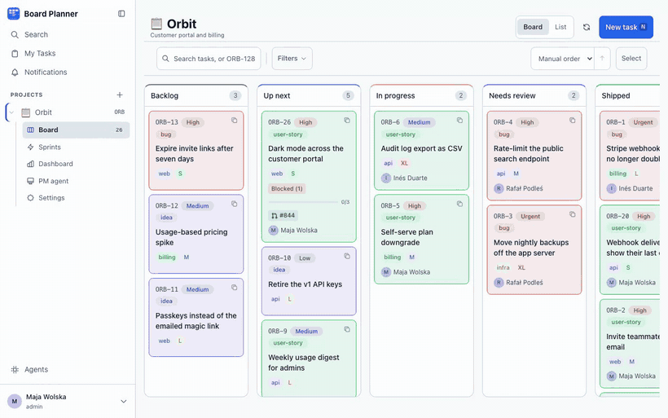

<div align="center">


# Board Planner

**One board. Your team works it. So do your agents.**

A Kanban board, sprints and a dashboard small teams can actually run — plus an MCP server and a
REST API, so coding agents pick up the same tasks under the same rules as everybody else.

<a href="https://board-planner.com"></a>
<a href="https://board-planner.com/docs"></a>
<a href="https://board-planner.com/docs/getting-started/quick-start/"></a>


<br><br>



</div>

---

Most trackers bolt automation on: a bot posts a comment, a script moves a card, and the real state
of the work lives somewhere the board cannot see. Board Planner starts from the other end. The
board, the REST API and the MCP server are three doors into one model, with the same permission
checks behind each. An agent moving a task to *In Review* passes the same status rules as a person
dragging the card, and leaves the same trail in the same history.

Self-hosted, single instance, no tenants. `docker compose up` and it is yours.

## The part nobody else ships

Plenty of tools can now make a machine write code. The interesting problem is not that — it is
everything around it: **who proposed the work, who approved it, what the machine was allowed to
touch, what had to pass before anything landed, and where it stops and gives the work back.** That
is the part Board Planner is actually about, and it is a first-class product surface rather than a
webhook you wire up yourself.

Two agents, at the two ends of that arc: a **PM agent** that proposes and writes things down, and
an **execution worker** that takes an approved task and does it. Neither decides anything you did
not let it decide.

<picture>
  <source media="(prefers-color-scheme: dark)" srcset="docs/images/pipeline-dark.svg">
  
</picture>

### It starts as a question, not a queue of tickets

The **PM agent** is a project manager that lives in the project. It reads the board, notices what
is stuck, duplicated or missing, and brings you the decision — rather than filing a pile of tickets
nobody asked for. It is good at the work nobody enjoys: writing the acceptance criteria a task was
created without, finding the duplicate, saying where a sprint actually stands.


Two things about that screenshot are the point. **The badge under the reply is the action** — the
message and the write are one record, so you can see a reply also changed `ORB-9` rather than
merely talking about it. And **it left the task where it was**, because it was told to. Board
reviews run with `change_status` and `create_task` withheld, so the autonomous path can tell you
something is wrong without quietly reorganising your board overnight.

It is off by default, per project, and metered rather than trusted: a daily cap on turns and an
optional cap on tokens, both spent by autonomous turns as well as yours, and an instance
administrator can lock it off for a project in a way project settings cannot override. Without
`OPENROUTER_API_KEY` the pages say so and the feature stays inert.

📖 [PM agent](https://board-planner.com/docs/ai/pm-agent/) ·
[Autonomous board reviews](https://board-planner.com/docs/ai/autonomous-board-reviews/)

### You hand it over the way you would hand it to a person

Assign the task, name an agent, drag it into the column you approve from. **That pair is the
hand-over** — nothing runs on a task that names no agent, and there is no falling back to a project
default. A task somebody else assigned to you is a proposal, not a job queued on your machine.

### An agent is composed, not configured

An **agent** is an ordered list of blocks, and there are exactly two kinds:

|  | Can it change anything? | Can it stop the run? |
| --- | --- | --- |
| **Step** — Implement, Push, Pull request, Merge | yes | no |
| **Gate** — Size, Protected files, Test written, Builds, Tests pass, Reviewed | no | yes |

A step cannot refuse and a gate cannot write. That single boundary is what makes a composition
readable: every block that could stop the run is a gate, and you can see all of them at a glance.

Each step is **its own model session**. Two steps in one agent share the task and the worktree and
nothing else — which is why *analyse, then implement* is genuinely different from asking one model
to do both: the second step reads what the first wrote, not what it was thinking.

**Merging is a step, not a switch.** There is no "auto-merge" checkbox and no rule that ties it to
a review setting. An agent merges because its sequence ends with a Merge block; leave it out and
the run stops at the pull request. What you read is what runs.

Three agents ship with it — **Default**, **With security review**, **Merges its own work** — and a
project that never opens the editor runs Default.

### The machine is not trusted, by construction

This is the part that took the longest to get right, and it is why the hand-over is safe to use on
a real repository:

| Guarantee | Why it holds |
| --- | --- |
| **The server never sends a path** | An assignment names a task and a git remote. The worker resolves its own checkout from a file on its own machine, so where anything lives stays a local decision. |
| **A read-only step cannot be talked into writing** | `Read only` becomes a tool list the worker builds itself. It is not a thing the board can express, so no prompt typed into a task can grant write access. |
| **A check the machine does not implement stops the run** | A gate naming an unknown kind refuses rather than skipping — a missing check must never look like a check that passed. |
| **Nothing executes the repo's own scripts unreviewed** | The editor refuses a Builds or Tests-pass gate over a change that Protected files has not read first, so a script the agent just wrote cannot run before something checked whether it was allowed to write it. |
| **The worker holds one credential, and never the database** | It talks to the app over REST with a `cpw_` credential registration minted. A box executing agent-written code has no business holding database credentials. |
| **It pushes as an account you named** | `gh auth switch` is global state on a developer machine, so the identity is pinned per worker rather than left to whatever somebody switched to last. |
| **A held task refuses to move** | While a run holds a task, a status change that would leave the column is refused with **409** through every writer — board, edit form, MCP, PM agent. Forcing past it is a person's gesture: any machine credential is refused. |
| **Failure lands in front of a human** | A usage limit returns the task with its attempt refunded; a crash spends one. A repeating failure runs out of retries and stops, instead of cycling forever. |

The whole run reports onto the task as it happens, so **the task's comments are the run log** —
branch, edits, which gate said no, how much model quota is left. No side channel, no CI tab.

📖 The full story: [Agents](https://board-planner.com/docs/ai/agents/) ·
[Execution workers](https://board-planner.com/docs/ai/execution-workers/) ·
[`worker/README.md`](worker/README.md)

## The rest of the board

### It's a board first

Columns you name, in an order you choose. Each one is mapped to a role automation understands
(`backlog`, `approved`, `active`, `review`, `blocked`, `done`), so renaming *Up next* to *Ready*
breaks nothing — and any column with the `review` role is a stop sign for automation, where work
waits for a person. Drag-and-drop board, list view, sprints, dependencies and subtasks, recurring
tasks, and ⌘K search across every task from anywhere in the app.

It follows your system theme, and the whole app is built for both:


### A task holds everything the work needs

Acceptance criteria that tick off one by one, dependencies, the pull request that closes it, custom
fields you define per project, every comment and every change since it was created. Nothing lives in
a side channel. Name a branch `bp-8/dark-mode` and the pull request finds its task on its own.


### Your agents work the same board

Fourteen MCP tools over HTTP put the board in your terminal, so Claude Code reads the backlog, claims
a task and moves it — through the same permissions a teammate gets. API tokens can be scoped to
specific projects, and the scope is enforced centrally, so it holds for REST and MCP alike.

### Enough to answer the Monday question

How you are doing, what is piling up, and whether you are finishing as fast as you are starting.
Six charts, no spreadsheet.


### The rest

Notifications in-app, by email, or to Slack and Discord — per user, per project, per event. Project
audit trail. Webhooks, signed. GitHub and GitLab PR linking. Works on a phone.

## Quick start

You need Docker with Compose 2.24 or newer — older Compose rejects the file's `env_file` entry even
without a `.env`. Nothing else: no Node, no MongoDB, not even a clone.

```bash
curl -fsSLO https://raw.githubusercontent.com/rafalpodles/board-planner/main/docker-compose.yml
docker compose up -d
```

That runs the published image, `ghcr.io/rafalpodles/board-planner`, built for `linux/amd64` and
`linux/arm64` on every release from 1.1.0 on — 1.0.x predates it and has no image. `:latest` is the
newest release; pin one with `BOARD_PLANNER_VERSION=1.2.3` in a `.env` next to the compose file. To upgrade,
`docker compose pull && docker compose up -d`.

The compose file on `main` needs an image of **1.1.2 or later**: it passes `COOKIE_ALLOW_INSECURE=auto`,
which 1.1.1 does not know, so a 1.1.1 image served over plain HTTP anywhere but localhost cannot
sign in. To run 1.1.1 with it, put `COOKIE_ALLOW_INSECURE=1` in `.env`.

**From a clone, run `docker compose up -d --build`.** Plain `docker compose up -d` pulls and runs
the last *release*, not the code you have checked out; `--build` builds the checkout and runs that.

### Upgrading from a build before the published image

Rename `NEXT_PUBLIC_APP_URL` in your `.env` to `PUBLIC_ORIGIN`. The app no longer reads the old name
at all; `docker-compose.yml` still passes it on as `PUBLIC_ORIGIN` when `PUBLIC_ORIGIN` is unset, so
an untouched `.env` keeps its links, but that fallback lives in the compose file only — any other
way of running the image needs `PUBLIC_ORIGIN` itself.

Open <http://localhost:3000>. The first account created on the sign-in page becomes the instance
administrator; every account after that is made from **Settings → Users**.

Creating that first account asks for a **setup code**, so whoever reaches a fresh instance before you
cannot claim it. Unless you set `BOOTSTRAP_TOKEN`, the app generates one and prints it to the server
log when it starts with no accounts — `docker compose logs app | grep "setup code"`. The code is
held in memory, so a restart prints a new one, and on more than one replica each prints its own:
set `BOOTSTRAP_TOKEN` there instead.

Stop it with `docker compose down`. The database lives in the `mongo-data` volume and survives that;
`docker compose down -v` deletes it.

### Without Docker

Needs **Node 26** and a **MongoDB 4.4+** you provision yourself.

```bash
npm install
MONGODB_URI=mongodb://localhost:27017/boardplanner npm run build
MONGODB_URI=mongodb://localhost:27017/boardplanner npm start
```

`npm run dev` for the development server. Copy `.env.example` to `.env.local` for a place to keep
the variables below. `npm start` listens on `PORT` — from the environment first, then from
`.env.production.local`, `.env.local`, `.env.production` and `.env`, in that order, as Next reads
them — and on `3000` when none names one.

## Connect an agent

The MCP server is built into the app at `POST /api/mcp` — nothing to clone, nothing to build. Create
a token under **Settings → API Tokens**, scope it to the projects the agent should touch, and point
the client at one URL:

```json
{
  "mcpServers": {
    "boardplanner": {
      "type": "http",
      "url": "https://your-instance.example.com/api/mcp",
      "headers": { "Authorization": "Bearer cp_..." }
    }
  }
}
```

Fourteen tools: `list_projects`, `get_project`, `list_tasks`, `get_task`, `create_task`,
`update_task`, `change_task_status`, `list_sprints`, `create_sprint`, `update_sprint`, `add_comment`,
`list_comments`, `link_tasks`, `unlink_tasks`.

Clients that want a connector instead of a pasted token get full **OAuth 2.1 with PKCE** and dynamic
client registration at the same URL — no client secret. For stdio-only clients, a standalone server
ships in [`mcp-server/`](mcp-server); it builds on its own and is not part of the Docker image:

```bash
cd mcp-server && npm install && npm run build
```

## Configuration

Everything is optional except the database. Put overrides in a `.env` file next to
`docker-compose.yml`; the compose file hands every variable in it to the app, except `NODE_ENV`,
`PORT` and `HOSTNAME`, which it pins to `production`, `3000` and `0.0.0.0`.

| Variable | Default | What it does |
| --- | --- | --- |
| `MONGODB_URI` | `mongodb://mongo:27017/boardplanner` | Point the app at your own MongoDB instead of the bundled one |
| `APP_PORT` | `3000` | Host port the app is published on |
| `APP_ORIGIN` | `http://localhost:${APP_PORT}` | Comma-separated origins the app is served from. Together with `PUBLIC_ORIGIN`, what a write's `Origin` is checked against when the browser sends no `Sec-Fetch-Site` |
| `PUBLIC_ORIGIN` | `NEXT_PUBLIC_APP_URL`, else `http://localhost:${APP_PORT}` (compose); otherwise `APP_ORIGIN` when it names exactly one origin | The one address this instance calls its own, and the base of every link it sends. Required for MCP, PM OAuth and enrolling a worker |
| `BOARD_PLANNER_VERSION` | `latest` | Which published image compose runs |
| `BOOTSTRAP_TOKEN` | generated, printed to the log | The setup code the first account is created with, 16 characters or more. Set it when the log is not where you can read it |
| `COOKIE_ALLOW_INSECURE` | `auto` (compose); off otherwise | `1` issues the session cookie without `Secure` and without the `__Host-` prefix, for an instance served over plain HTTP. `auto` does that only while `PUBLIC_ORIGIN` and every `APP_ORIGIN` are `http://` and the sign-in did not arrive over `https://`. `0`, empty or unset: the secure cookie |
| `TRUSTED_PROXY_HOPS` | `0` | How many proxies append to `X-Forwarded-For` in front of this app |
| `ENCRYPTION_KEY` | — | 32 bytes, hex or standard base64 (not base64url), encrypting stored integration tokens and chat webhook URLs at rest |
| `ENCRYPTION_KEYS_OLD` | — | Comma-separated retired keys, so a rotation can still read what they wrote |
| `WEBHOOK_SIGNING_SECRET` | — | Signs outgoing webhook deliveries |
| `OPENAI_API_KEY` | — | AI task generation in the task form. The older name `OPENAPI_KEY` is still accepted |
| `AI_DAILY_GENERATION_CAP` | `200` | AI task generations one project may run per day, on the instance's key. Each person may also start 20 per 15 minutes, one at a time |
| `OPENROUTER_API_KEY`, `PM_MODEL`, `PM_MAX_TOKENS`, `PM_DAILY_TURN_CAP`, `PM_DAILY_TOKEN_CAP`, `PM_SCHEDULER_TICK_MS` | — | PM agent |
| `OPENROUTER_BASE_URL` | `https://openrouter.ai/api/v1` | Where PM agent calls go — a proxy, or another OpenAI-compatible endpoint |
| `SMTP_HOST`, `SMTP_PORT`, `SMTP_USER`, `SMTP_PASS`, `SMTP_FROM` | — | Email notifications |
| `DIGEST_HOUR`, `DIGEST_TIMEZONE`, `DIGEST_TICK_MS` | `7`, `Europe/Warsaw`, `300000` | When the opt-in daily digest goes out |
| `GITHUB_SYNC_TICK_MS` | `300000` | How often projects with a GitHub token are re-synced; `0` turns the background sync off |
| `GITHUB_API_BASE_URL` | `https://api.github.com` | Where GitHub's API is, for GitHub Enterprise Server |

A few of these have sharp edges worth reading once.

<details>
<summary><strong><code>COOKIE_ALLOW_INSECURE</code> and <code>APP_ORIGIN</code></strong> — behind TLS, set <code>PUBLIC_ORIGIN</code> to the https address</summary>

Both are **runtime** values, read on every request. The compose file passes
`COOKIE_ALLOW_INSECURE=auto` unless `.env` says otherwise, and an empty value counts as unset. `auto`
issues the plain cookie only while `PUBLIC_ORIGIN` and every entry in `APP_ORIGIN` are `http://` —
the compose defaults, `http://localhost` — because a browser silently discards a `Secure` cookie
over plain HTTP anywhere but localhost, and every request after login then fails with a 401. **Once
the instance is behind TLS, set `PUBLIC_ORIGIN` (and `APP_ORIGIN`) to its `https://` address** and
the cookie is `Secure` and `__Host-`-prefixed with nothing else to change. Until you do, `auto`
still issues the secure cookie to a sign-in whose `Origin` is `https://`, so an instance reached over
TLS with its origins left at the defaults is not downgraded. `COOKIE_ALLOW_INSECURE=0` forces the
secure cookie whatever the origins say; `1` forces the plain one. Outside compose the app's own
default is the secure cookie, and only `1` or `auto` turns it off.

`APP_ORIGIN` is **required whenever `COOKIE_ALLOW_INSECURE=1`**, and the app refuses to start
otherwise — as it does when `1` meets an `https://` `APP_ORIGIN` or `PUBLIC_ORIGIN`. Writes are rejected unless the browser proves the request came from the app's own origin,
and over plain HTTP at anything other than `localhost` the browser sends no `Sec-Fetch-Site` header,
so the only remaining proof is `Origin` matching this list or `PUBLIC_ORIGIN`. Set it to the URL
users actually open — `https://board.example.com`, or `http://192.168.1.10:3000` for a LAN
self-host — with no trailing path.

The same fallback applies anywhere a proxy or CDN strips `Sec-Fetch-*` headers: writes, sign-in and
the OAuth authorize step then pass only if `Origin` is one of `APP_ORIGIN` or `PUBLIC_ORIGIN`. The
app logs one warning when it first sees a request that carries `Origin` but no `Sec-Fetch-Site`.

</details>

<details>
<summary><strong><code>TRUSTED_PROXY_HOPS</code></strong> — too low is the worse mistake</summary>

This decides whether `X-Forwarded-For` means anything here. It is the only thing the failed-login
throttle can key on, and the header is a header: with nothing in front of the app, a caller who
varies it gets a fresh counter every request and the throttle never bites. So the default is `0` —
the header is not read at all, and anonymous callers share one bucket at a raised threshold.

**Behind a reverse proxy, set it to the number of proxies that append to that header** — measured,
not guessed; see below. `1` is a single nginx or Caddy in front and nothing else.

Getting the number wrong has consequences in both directions. Set it **too high** and the header is
refused as not matching what you described — every caller then shares the anonymous bucket, which is
bounded but shared. Set it **too low** and the address counted is one your proxy chain writes rather
than the client's, so every request on earth may land in the same bucket — and because that bucket
looks to the app like a genuine address, it is metered at the *tight* per-address ceilings rather
than the raised anonymous ones. Too low throttles the whole world as though it were one caller.

**Measure it rather than guess.** At `0`, a request carrying `X-Forwarded-For` to a route that
throttles by address — sign-in, password reset, the OAuth endpoints, machine enrolment, account
changes — makes the app log a warning that names how many entries the header held:

```
A request arrived with X-Forwarded-For carrying 2 entries while TRUSTED_PROXY_HOPS=0, so the
header is ignored and the login throttle has no per-address key. …
```

To produce that line, leave the variable unset and **attempt a sign-in** at the address your users
use. A wrong password is enough. *Loading* the page logs nothing: the header is read when a request
is throttled by address, which on the login route is after the username and password have been
accepted as present. Then read the count from the log, set `TRUSTED_PROXY_HOPS` to it and restart —
the warning stops.

Expect **more than one** entry when a CDN sits in front of a hosting platform that itself proxies,
because each appends one. How many is what the log answers; counting the boxes you pay for is not
counting the hops, which is the whole reason to measure.

**The count is the value only where every proxy appends.** One that *replaces* the header hides
everything before it — Caddy does exactly that unless its
[`trusted_proxies`](https://caddyserver.com/docs/caddyfile/directives/reverse_proxy#trusted_proxies)
names the proxy in front of it. Behind a CDN such a proxy makes the log say `1`, and setting `1`
would then key the throttle on the CDN's edge address rather than the visitor's — the "too low"
failure above. Make each proxy append first, then measure.

Read the count off a request **you** made through the whole chain. A caller can send the header too,
and a health check or uptime probe that reaches the app by a shorter path carries fewer entries than
a browser does. That is why the app reports each *new* count rather than only the first: the first four distinct
counts go out at once, and past that a further new one waits out ten minutes. **That bound can be
held open against you.** The app cannot tell your sign-in from a forged header, so a caller sending a
fresh header length every few minutes keeps the slot taken and your own line may never appear. The
way out is a **restart**: it empties what the app has reported and frees the first four, so restart
and attempt the sign-in straight afterwards. A header carrying no address at all is never reported
and costs none of the four.

</details>

<details>
<summary><strong><code>ENCRYPTION_KEY</code></strong> — how to generate one, and how to rotate it</summary>

It encrypts the GitHub, GitLab, Coda and MCP credentials the app stores, and the Slack/Discord
webhook URLs behind a project's team channels and a person's own notifications — an incoming-webhook
URL is a bearer credential, and anyone holding it posts into that room as the integration. Generate
one with `openssl rand -hex 32`. Without it those fields simply cannot be saved — the app answers
the save with an error rather than writing the secret in cleartext, and says so at startup. **A
board that used team channels before this instance had a key still has those URLs in cleartext:
`npx tsx scripts/migrate-channel-webhooks.ts` rewrites them, and they are worth rotating in Slack
or Discord either way.** A key that is set
but is not 32 bytes of hex or standard base64 **stops the app from starting**: a fumbled variable is
not the same as an absent one and must not be treated as one. That includes base64url and a
passphrase that happens to decode to 32 bytes. If secrets were already saved with such a value, do not
generate a new key — convert the same bytes to hex with
`node -e 'console.log(Buffer.from(process.env.ENCRYPTION_KEY.trim(), "base64").toString("hex"))'`
and set that.

To rotate: put the new key in `ENCRYPTION_KEY` and move the old one to `ENCRYPTION_KEYS_OLD`
(comma-separated, so several generations can coexist). Each stored value names the key that wrote
it, so old and new secrets are readable side by side; anything re-saved is written with the new key.
Drop a retired key from the list only once nothing still refers to it — the app names the missing key
id when it meets one it cannot read.

</details>

<details>
<summary><strong><code>PUBLIC_ORIGIN</code></strong> — set it to the address people use</summary>

Every link the app builds to itself — in mail, in a Slack or Discord message, in a Coda row, the
page a worker's machine opens to be approved — starts with `PUBLIC_ORIGIN`. It is read when the app
runs, so one published image serves every instance; nothing about the address is baked in when it is
built.

`PUBLIC_ORIGIN` exists because `APP_ORIGIN` cannot answer "what is this instance's own address": it
is a list, and nothing says which entry is the public one. When it names exactly one origin it is
used; otherwise nothing is guessed.

So **an instance reachable at anything other than the compose default must set `PUBLIC_ORIGIN`.**
When it resolves to nothing:

- the MCP endpoint, both `/.well-known` documents, the PM agent's OAuth `redirect_uri`, enrolling a
  worker and a password reset by email answer **500**;
- changing your email address answers **503**, because the confirmation link cannot be built;
- notification mail, Slack and Discord messages still go out, without their links, and Coda rows
  get an empty Link.

Deliberately: the values these used to fall back to were a request header or an address from the
build machine. Adding a second origin to `APP_ORIGIN` without setting `PUBLIC_ORIGIN` lands here
too, because a list cannot say which entry is the instance's own. It must be an `http`/`https` URL; `board.example.com:8443` is not
one, however much it looks like it.

</details>

> [!IMPORTANT]
> MongoDB is pinned to **4.4** and is not published on a host port — only the app container reaches
> it. The aggregations deliberately avoid operators that only exist from 5.0, and pinning the
> version is what keeps that true.

## How it is built

Next.js 16 (App Router) and TypeScript, Tailwind CSS 4, MongoDB with Mongoose. Auth is a session
cookie in the browser and a Bearer token for API clients and OAuth; the browser never holds a
password.

```
src/
  app/api/          REST API — ~90 routes, plus the MCP endpoint at /api/mcp
  app/              board, task detail, sprints, dashboard, search, settings
  components/       kanban/, tasks/, search/, shell/, pm/, settings/, ui/
  lib/              auth, notifications, webhooks, custom fields, PM agent, force guard
  models/           Mongoose schemas
mcp-server/         standalone stdio MCP server
worker/             execution worker — claims tasks, runs an agent, enforces gates
menubar/            macOS menu bar app
e2e/                Playwright specs
```

## Development

```bash
npm test           # unit tests (vitest)
npm run test:e2e   # end-to-end tests (playwright)
npx tsc --noEmit   # types
```

Give an e2e run its own ports and database, since the fixture is not isolated by default:

```bash
E2E_PORT=3200 PM_STUB_PORT=3201 E2E_MONGODB_URI=mongodb://localhost:27017/local_e2e npx playwright test
```

## Website and documentation

**[board-planner.com](https://board-planner.com)** is the product tour — a board you can actually
drag a card on, a worker run you can try to interrupt while it is going, and the gate that refuses.
If this README interested you, that page is the five minutes worth spending next.

**[board-planner.com/docs](https://board-planner.com/docs)** is the manual, twenty-eight pages of
it, and the single source of truth: it lives in the `board-planner-site` repository and publishes
on merge, so a page there is never behind the product.

| Page | Covers |
| --- | --- |
| [What is Board Planner](https://board-planner.com/docs/getting-started/what-is-board-planner/) | The idea, who it is for, what it is not |
| [Quick start](https://board-planner.com/docs/getting-started/quick-start/) | First project, first task, first agent |
| [PM agent](https://board-planner.com/docs/ai/pm-agent/) | Turning it on, what it may change, the caps it spends against |
| [Claude Code and MCP](https://board-planner.com/docs/ai/claude-code-and-mcp/) | The fourteen tools, scoped tokens, the OAuth connector |
| [Agents](https://board-planner.com/docs/ai/agents/) | Steps, gates, and what a run actually does |
| [Execution workers](https://board-planner.com/docs/ai/execution-workers/) | Enrolling a machine, which tasks get picked up, how to stop one |
| [Installing and running](https://board-planner.com/docs/administration/installing-and-running/) | Every environment variable, build and deploy |
| [REST API](https://board-planner.com/docs/reference/rest-api/) | Endpoints, auth, pagination |

## Licence

Board Planner is free software under the [GNU Affero General Public License v3](LICENSE). One
directory is the exception: [`src/ee/`](src/ee/) is the commercial Enterprise Edition, licensed
under [its own terms](src/ee/LICENSE) and usable with a Board Planner subscription or licence
key. It is empty today; paid connectors and paid AI features will live there. Contributions are
welcome to everything else, see [CONTRIBUTING.md](CONTRIBUTING.md).
